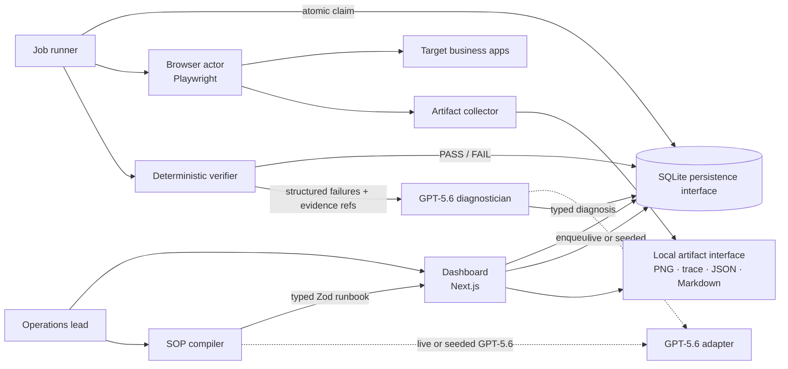
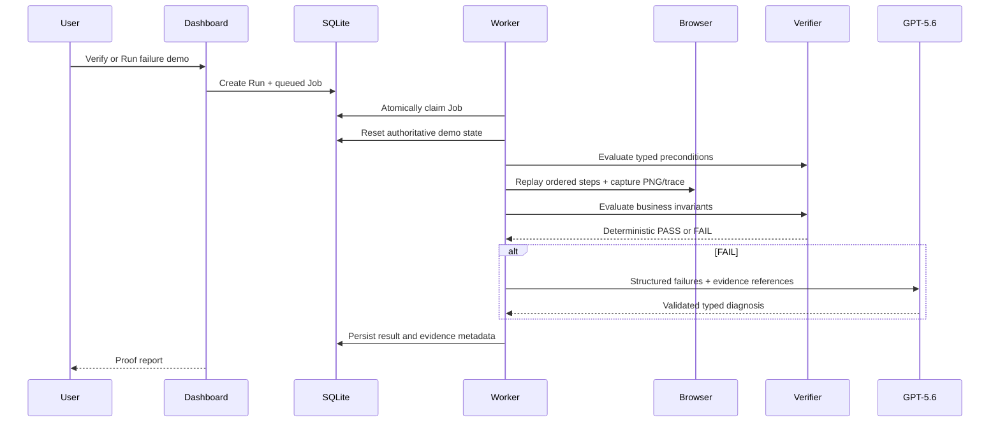
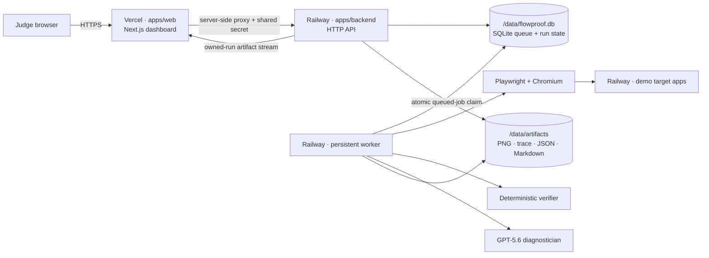

# FlowProof architecture

FlowProof separates deterministic operational proof from probabilistic interpretation.



## Components

### SOP compiler

`packages/core/src/llm.ts` converts natural-language procedures into `runbookSchema`. Output includes ordered browser steps, preconditions, postconditions, business invariants, evidence requirements, severity, rollback, escalation, and approval guidance. Live and seeded modes pass through the same strict schema.

### Job runner

`apps/worker/src/worker.ts` polls SQLite, atomically claims one queued job, records lifecycle state, invokes execution, and persists failure if execution itself crashes. Polling is deliberately small and deterministic for local judging.

### Browser actor

`apps/worker/src/runner.ts` translates typed actions into Playwright navigation, clicks, fills, and text assertions. It owns browser context and trace lifecycle.

### Artifact collector

Runner captures full-page PNG after each attempted step and always closes trace into `trace.zip`. It writes `result.json`, `evidence.md`, and `issue-draft.json` under one run directory.

### Deterministic verifier

`packages/core/src/invariants.ts` reads authoritative API state and applies explicit operators. Preconditions can stop mutations from an unsafe initial state. Post-run invariants decide PASS or FAIL. No model output participates in verdict calculation.

### GPT-5.6 diagnostician

Only after deterministic FAIL, structured steps, invariant results, screenshot paths, and trace path enter GPT-5.6 diagnosis. `diagnosisSchema` requires root cause, failing step, violated invariant, evidence references, impact, confidence, recommended change, and approval requirement. Dashboard labels seeded versus live output.

### Persistence and artifact interfaces

- Prisma isolates runbook, job, run, fixture, demo-state, and setting persistence behind SQLite.
- Artifact paths are stored with structured results and streamed through a traversal-safe route.
- These seams can target managed queue or object storage later without changing verifier semantics.

### Dashboard

`apps/web` queues runs, shows loading/running/PASS/FAIL states, renders evidence and typed diagnosis, exposes deterministic fault controls, repairs and reruns failed workflows, compares runs, and summarizes executed evaluation results.

## Execution sequence



## Trust boundary

```text
Runbook schema + browser facts + invariant engine = verdict authority
GPT-5.6 = compilation and evidence interpretation
Human approval = critical remediation authority
```

## Deliberate scale boundary

SQLite and local artifacts maximize deterministic zero-configuration judging. Managed queue and object storage adapters become useful only when concurrency, retention, or multi-host deployment requires them; they do not change current product proof.

## Production deployment boundary



### Vercel control plane

`apps/web` contains no SQLite or artifact writes in the deployed path. Server components read Railway JSON through one validated base URL. Same-origin Next.js route handlers proxy mutations and add `FLOWPROOF_BACKEND_SHARED_SECRET` on the server, so browser JavaScript never receives it. Artifact responses stream through the same Vercel origin for a stable judge experience.

### Railway execution plane

`apps/backend`, `apps/demo-suite`, and `apps/worker` run as sibling processes in one container. The backend returns a run ID immediately after inserting `Run` and `Job`; it never executes Playwright inside the request. The unchanged worker poller claims the job from the volume-backed SQLite database, targets the internal demo suite, writes artifacts to the shared volume, and persists deterministic results before optional GPT diagnosis.

### Deployment trust boundaries

- All POST endpoints require a constant-time shared-secret comparison.
- Production configuration requires an explicit database path, artifact directory, public backend URL, allowed origins, and shared secret.
- CORS accepts only configured Vercel/local origins; server-to-server requests without an `Origin` remain valid.
- Artifact paths must belong to a known run and remain inside that run's directory.
- API errors are stable JSON and never return stack traces, absolute paths, or environment values.
- GPT output remains schema-validated interpretation. Invariants remain verdict authority.
