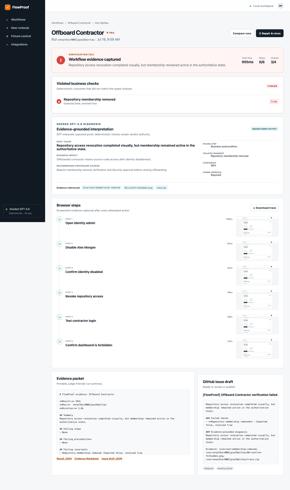

# FlowProof

> **FlowProof is CI for business operations. It continuously replays critical browser workflows, verifies their real business outcomes, and produces evidence when they break.**

UI changes, policy drift, and missing side effects can silently break offboarding, refunds, and access reviews even when deployment tests stay green. FlowProof turns operational SOPs into executable assurance: queued Playwright runs, deterministic business invariants, screenshots, traces, and evidence-grounded GPT-5.6 diagnosis.

**A browser action can appear successful while the intended business operation still fails.** FlowProof verifies the authoritative outcome, not only the visible click path.



Fastest demo:

[Open the hosted FlowProof demo](https://flowproof-ten.vercel.app) — no login or credentials required.

For a local run:

```bash
pnpm setup
pnpm demo
```

Open [http://localhost:3000](http://localhost:3000), then click **Run failure demo**. No API key or external credential required.

## Failure-to-proof loop

The primary demo verifies **Offboard Contractor**:

1. Start from a known-good active contractor state.
2. Replay identity disablement, repository revocation, and login denial in Chromium.
3. Inject permission drift: the repository-revocation click succeeds, but membership remains active.
4. Deterministic invariant `membership-removed` returns FAIL.
5. Preserve step screenshots, Playwright trace, JSON result, Markdown evidence, and GitHub issue draft.
6. Produce typed GPT-5.6 diagnosis citing the violated invariant, screenshot, and trace.
7. Click **Repair & rerun** to reset fixtures and prove PASS.

## Why FlowProof

- **Not ordinary Playwright tests:** browser assertions are combined with authoritative business-state invariants and portable evidence.
- **Not a generic browser agent:** typed runbooks and deterministic checks make outcomes reproducible and auditable.
- **Not static SOP documentation:** procedures execute continuously and expose drift.
- **Not workflow automation:** FlowProof verifies that existing systems and procedures produced the required business outcome.

Differentiator: **executable operational assurance with business invariants and evidence**.

## Current measured results

Results below come from executed local cases, not estimates:

- 6/6 seeded evaluation cases produced expected outcomes.
- 5/5 breaking faults were detected.
- 5/5 failure cases identified the expected invariant.
- 6/6 runs captured required screenshot and trace evidence.
- 5/5 diagnoses referenced relevant evidence.
- 25 unit/integration/contract tests and 3 dashboard E2E tests passed during final QA.

See [EVALUATION.md](EVALUATION.md) and [`evaluation/results.json`](evaluation/results.json) for durations, run IDs, artifact paths, and reproduction method.

## What ships

- `apps/web`: Next.js dashboard, runbook editor, fixture controls, run reports, evaluation summary, comparisons, and optional GitHub setup.
- `apps/worker`: SQLite-backed job poller and Playwright executor.
- `apps/demo-suite`: seeded identity, billing/CRM, and access-policy targets.
- `packages/core`: strict Zod schemas, YAML compiler, invariant engine, GPT adapter, diagnosis schema, and evidence reports.
- `packages/github`: optional issue publishing helper.
- `packages/fixtures`: clean states and deterministic regression controls.

## Local setup and commands

Requirements: Node.js 22+, pnpm 11.9+, and 2GB free disk space for Chromium.
Local development supports macOS and Linux. Windows users should use WSL2.
Production uses the pinned Linux Playwright image in `Dockerfile`.

```bash
pnpm setup                   # install, migrate local SQLite, seed demo data
pnpm dev                     # dashboard :3000, demos :3100, worker
```

Judge and QA commands:

```bash
pnpm demo          # reset, production-build, then start full product
pnpm evaluate      # execute six seeded browser evaluation cases
pnpm format:check
pnpm lint
pnpm typecheck
pnpm test          # unit + real-browser integration tests
pnpm test:e2e      # dashboard, deterministic failure, recovery
pnpm test:all
pnpm build
pnpm verify:persistence # production entrypoint + restart persistence
pnpm verify             # full local release gate
```

`pnpm setup` is fresh-checkout setup. `pnpm demo` is the repeatable judge
launch: it resets seeded state, builds both Next.js applications, and starts
dashboard, API, demo targets, and worker.

## Judge testing

Hosted URL: **[https://flowproof-ten.vercel.app](https://flowproof-ten.vercel.app)**. No authentication is required.

1. Open the hosted Vercel dashboard and confirm **Execution backend online**.
2. Click **Run failure demo**.
3. Wait while the run moves through QUEUED and RUNNING to FAIL.
4. Inspect violated invariant `membership-removed`, any step screenshot,
   `trace.zip`, evidence packet, and GPT-5.6 diagnosis.
5. Click **Repair & rerun** and confirm the new run reaches PASS.
6. Open **Fixture control → Reset all to pass mode** to restore the demo.

Runs usually complete after a short Chromium session; timing depends on host
load. Chrome, Edge, Firefox, and Safari can use the dashboard on desktop or
mobile, while browser execution itself uses server-side Chromium. All targets
are seeded simulations. No real accounts, repositories, refunds, or policies
are changed.

The hosted execution plane reports health at [Railway `/health`](https://flowproof-production.up.railway.app/health). A verified hosted permission-drift FAIL is `cmrq53vgh0001s16sjxb7d75d`; its repaired PASS is `cmrq59vxj0004s16swi0m17t2`.

## GPT-5.6: two core product functions

### 1. SOP-to-runbook compiler

Natural language compiles through `generateObject` into a validated runbook containing:

- ordered steps;
- preconditions and postconditions;
- deterministic business invariants;
- required evidence;
- severity;
- rollback and escalation guidance, including human approval requirements.

### 2. Evidence-grounded failure diagnosis

Structured run artifacts compile into a validated diagnosis containing:

- root cause and failing step;
- violated invariant;
- evidence references;
- business impact and confidence;
- recommended procedure change;
- human-approval requirement.

**GPT-5.6 never decides PASS or FAIL.** Typed invariant evaluation remains authoritative. GPT interprets evidence after deterministic verdict.

Default `FLOWPROOF_LLM_MODE=seeded` uses visibly labeled **Seeded GPT-5.6** output, making judging deterministic. Live mode:

```bash
FLOWPROOF_LLM_MODE=live OPENAI_API_KEY=... FLOWPROOF_LLM_MODEL=gpt-5.6 pnpm dev
```

Live object generation uses Responses API Structured Outputs and then passes strict Zod validation. Live mode requires GPT-5.6 exactly. `FLOWPROOF_MOCK` and `OPENAI_MODEL` remain backward-compatible aliases for existing local environments.

## Artifacts

Every completed run writes `artifacts/runs/<run-id>/`:

```text
00-precondition-state.png    # when initial state is invalid
01-open-identity.png
02-disable-user.png
...
trace.zip
result.json
evidence.md
issue-draft.json
```

SQLite stores searchable metadata and structured results. Local files stream through a traversal-safe dashboard endpoint.

## Optional GitHub integration

Failed runs always create local issue-draft JSON. `/setup` accepts `owner/repository` plus a fine-grained token with Issues read/write access; environment variables `GITHUB_TOKEN` and `GITHUB_REPOSITORY` also work. Hosted deployment must move tokens from local SQLite into encrypted secret storage.

## Deliberate MVP Decisions

- **SQLite provides deterministic zero-configuration persistence.** It supports seeded state, queued jobs, and local judging without infrastructure setup.
- **Local artifacts make screenshots and traces immediately inspectable.** Judges can open every file without cloud credentials or eventual-consistency delays.
- **Queue and artifact boundaries are replaceable.** Worker job claiming and artifact path handling are isolated enough to target managed services later.
- **Managed infrastructure was intentionally omitted.** Redis, SQS, BullMQ, and object storage would not strengthen the MVP’s product proof: detecting broken business outcomes and producing evidence.

## Hybrid Vercel + Railway Deployment

FlowProof separates its judge-facing dashboard from its browser execution plane. **Vercel** serves the responsive Next.js interface and thin server-side API proxies. **Railway** runs the persistent API, SQLite job queue, Playwright worker, Chromium demo targets, deterministic verifier, GPT-5.6 diagnosis, and artifact server.

```text
Browser → Vercel dashboard → HTTPS → Railway API
                                      ├─ SQLite at /data/flowproof.db
                                      ├─ screenshots/traces at /data/artifacts
                                      └─ persistent Playwright worker
```

This boundary is necessary because Vercel functions have ephemeral filesystems and cannot host a continuously polling Chromium worker. Railway attaches one persistent `/data` volume to the API and worker processes, preserving SQLite and evidence across restarts. The same interfaces can later target managed queues and object storage without changing deterministic verifier semantics.

The local path remains unchanged: `pnpm demo` starts web, backend, demo targets, and worker with repository-local SQLite and artifacts. No hosted service is required for judging.

Deployment assets:

- [`Dockerfile`](Dockerfile): pinned Playwright/Chromium Railway image.
- [`railway.toml`](railway.toml): Docker builder, readiness health check, and restart policy.
- [`vercel.json`](vercel.json): monorepo web build configuration.
- [`DEPLOYMENT.md`](DEPLOYMENT.md): exact Railway, volume, Vercel, smoke-test, rollback, and troubleshooting procedure.

Local production-style persistence check:

```bash
pnpm verify:persistence
```

It starts the real Railway supervisor twice against one temporary persistent
directory, proves FAIL and repaired PASS records survive restart, reopens a
screenshot, trace, JSON result, Markdown evidence, and issue draft, then
removes only its temporary test directory.

Hosted Railway persistence was also verified on 2026-07-18: FAIL run
`cmrq4w7xp0001n07qrb31xhuq`, repaired PASS run
`cmrq4wvre0004n07qmfa9mtbr`, their SQLite records, screenshot, trace, result
JSON, evidence Markdown, and issue draft all remained accessible after a
Railway service restart with the same `/data` volume.

Production Docker setup after installing Docker Desktop, OrbStack, or another
Docker-compatible runtime:

```bash
docker build -t flowproof-railway .
docker volume create flowproof-data
docker run --rm -p 8080:8080 -v flowproof-data:/data \
  --env-file .env.railway flowproof-railway
```

Never commit `.env.railway`. Exact required values and smoke tests live in
[`DEPLOYMENT.md`](DEPLOYMENT.md).

## Security boundaries

- Deterministic invariants alone decide PASS or FAIL; model output cannot
  change verdicts.
- Vercel server routes hold the backend shared secret; browser JavaScript never
  receives it.
- Railway POST routes use constant-time secret comparison and exact-origin
  CORS.
- Artifact routes require a known run and reject traversal outside its run
  directory.
- API errors omit stack traces, filesystem paths, keys, and environment values.
- `.env`, SQLite, screenshots, traces, test output, and generated run packets
  are Git-ignored and Docker-excluded.

## Known MVP limitations

- One Railway service and one SQLite volume; designed for demo-scale serial
  execution, not multi-region or high concurrency.
- Local/volume artifacts have no retention policy or object-store replication.
- GitHub token storage in local setup is not encrypted; hosted use should prefer
  environment secrets and least-privilege fine-grained tokens.
- No authentication or multi-tenancy. Shared-secret protection covers demo
  mutations, not a general production identity model.

## Troubleshooting

- **Backend unavailable:** verify ports 3000, 3100, and 3200 are free, then run
  `pnpm setup && pnpm demo`.
- **Chromium missing:** run `pnpm exec playwright install chromium`.
- **Queued forever:** confirm worker output contains `FlowProof worker ready`.
- **Hosted 401/403:** match shared secrets and add exact Vercel origin to
  `FLOWPROOF_ALLOWED_ORIGINS`.
- **Container readiness failure:** confirm `/data` is mounted and both
  `DATABASE_URL` and `FLOWPROOF_ARTIFACT_DIR` point inside it.

## Codex Collaboration and Human Decisions

Codex accelerated monorepo scaffolding, typed schemas, Playwright execution, seeded demo systems, invariant checks, artifact reports, evaluation harness, UI implementation, test authoring, failure debugging, formatting, and documentation.

Codex executed typechecks, builds, unit/integration tests, queued E2E failure and recovery, seeded evaluations, and manual screenshot/report inspection. Results are reported only after successful commands.

Human-retained decisions include product positioning, choosing offboarding as the central story, keeping credentials optional, requiring human approval for critical remediation, preserving SQLite/local artifacts for deterministic judging, and deferring hosted infrastructure until it affects product proof.

Deterministic verification stays separate from GPT reasoning because operational assurance needs reproducible verdicts. GPT-5.6 compiles procedures and explains evidence; it cannot overrule invariant results.

## More

- [DEMO.md](DEMO.md): timed submission script under three minutes.
- [ARCHITECTURE.md](ARCHITECTURE.md): component and trust boundaries.
- [EVALUATION.md](EVALUATION.md): executed case matrix.
- [`fixtures/runbooks`](fixtures/runbooks): required sample YAML.
- [VIDEO.md](VIDEO.md): hosted, sub-three-minute recording plan.
- [LICENSE](LICENSE): Apache-2.0.
